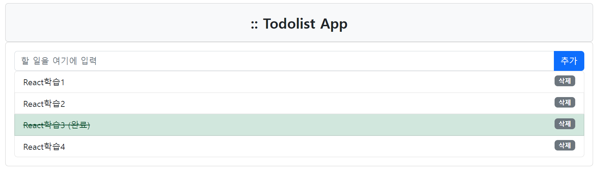
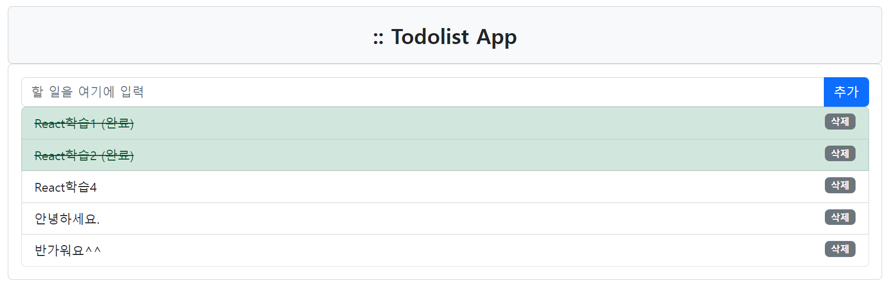

# **Project - todolist-app** 📝

 ## 💡 `React & Vite` PROJECT   <br>
   


---

### 🧾 프로젝트 소개 

---

>**VSCode 환경 구축**

> 1. VSCode 설치
> 2. node.js 설치
> 3. Vite(+React) 설치
```
npm create vite@latest todolist-app --template react
```

---

#### main



<br> 

#### 할 일 - | 수정 | 삭제 | 완료 |



```
◾ 할 일 목록을 기재하여 '추가'
◾ 할 일이 아니라면 '삭제'
◾ 할 일 완료 후 '완료' 처리 
```

